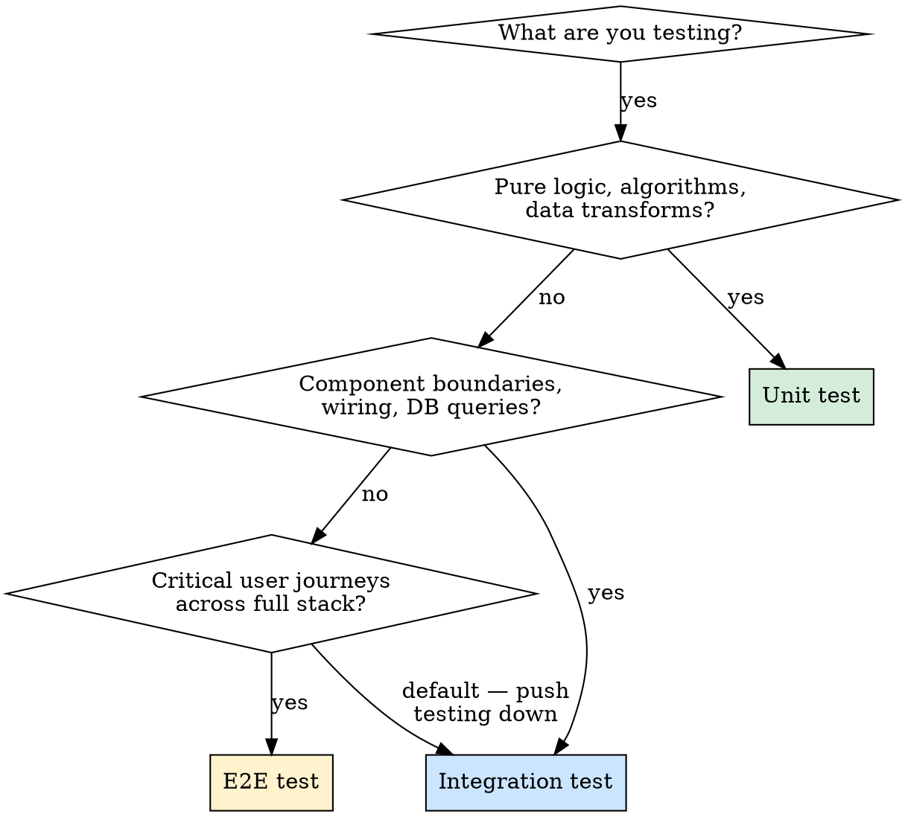
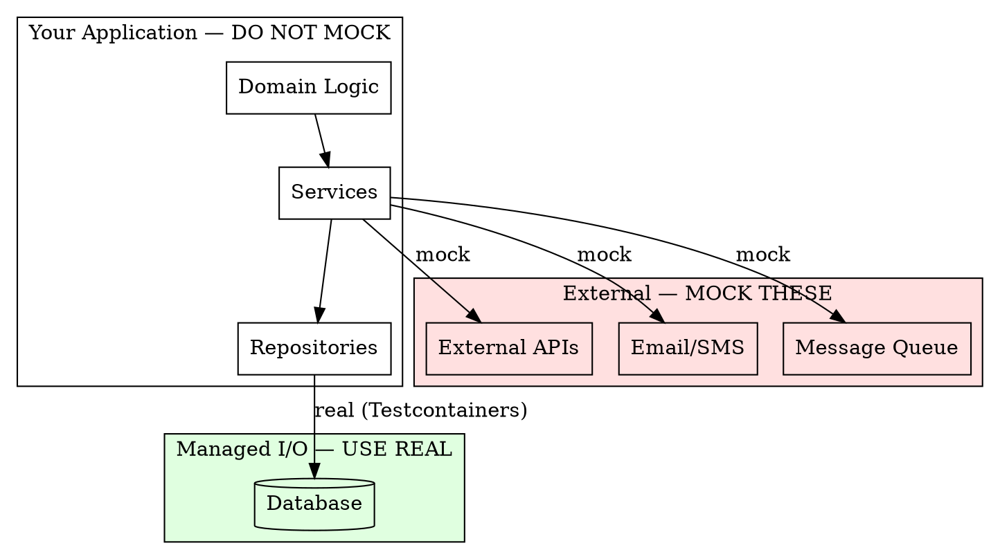

# Writing Effective Tests

## Overview

**Process + Craft.** Good testing requires both: the discipline to write the test first (TDD process) and the knowledge to write the *right* test (craft). This skill integrates both.

**The Iron Law:** No production code without a failing test first. Write code before the test? Delete it. Start over.

**The Core Quality:** Resistance to refactoring. If internal restructuring breaks the test but behavior hasn't changed, the test is wrong, not the code.

## Project-Specific Patterns

Before writing tests, check if the current project has additional test conventions:
- `docs/development/TEST_PATTERNS.md` — project-specific test rules, DB constraints, data setup patterns
- `.claude/skills/` in the project root — project-level skills that supplement this one
- `CLAUDE.md` — may contain test-related instructions

Read and follow any project-specific patterns found.

**Conflict resolution:** If a project pattern contradicts this skill (e.g., project says "expect 500 for unauthenticated" but this skill says "test for 401"), the project pattern wins for that project. But **flag the conflict** to the user: "Note: project pattern X conflicts with general best practice Y. Following project pattern per TEST_PATTERNS.md. Should we align these?" This prevents silent drift and gives the team a chance to fix either the project or the global rule.

## The Cycle: RED → GREEN → REFACTOR

Every feature, bug fix, and behavior change follows this cycle. At each step, craft decisions determine quality.

```dot
digraph tdd_craft {
    rankdir=LR;
    red [label="RED\n1. Choose test type\n2. Set mock boundary\n3. Write failing test", shape=box, style=filled, fillcolor="#ffcccc"];
    verify_red [label="Watch it fail\n(correct reason)", shape=diamond];
    green [label="GREEN\nMinimal code\nto pass", shape=box, style=filled, fillcolor="#ccffcc"];
    verify_green [label="All tests\npass?", shape=diamond];
    refactor [label="REFACTOR\nImprove testability\n(stay green)", shape=box, style=filled, fillcolor="#ccccff"];

    red -> verify_red;
    verify_red -> green [label="fails correctly"];
    verify_red -> red [label="wrong failure\nor passes"];
    green -> verify_green;
    verify_green -> refactor [label="yes"];
    verify_green -> green [label="no"];
    refactor -> verify_green;
}
```



---

## RED: Write the Failing Test

Before writing ANY production code, make three craft decisions:

### Decision 1: What Type of Test?



**Test ratio by architecture:**

| Architecture | Shape | Ratio |
|---|---|---|
| Monolith with rich domain logic | Pyramid | 70% unit, 20% integration, 10% E2E |
| API service / microservice | Honeycomb | 20% unit, 70% integration, 10% E2E |
| Frontend SPA | Trophy | 20% unit, 60% integration, 20% E2E |

**When in doubt:** Write an integration test. They give the highest confidence-per-test for most modern applications.

### Decision 2: What to Mock?

This is the single most misunderstood concept. Get this right:



**Rules:**
- **Mock unmanaged dependencies** — external APIs, email, message queues (things other systems observe)
- **Do NOT mock managed dependencies** — your own classes, repositories, domain objects
- **Do NOT mock the database Session** — `MagicMock()`ing Session and asserting `db.add.assert_called_once()` is testing implementation. Use a real test database.
- **Do NOT mock things you don't own** — don't mock HTTP libraries or DB drivers. Use fakes or real instances.

**Test doubles quick reference:**

| Double | Purpose | Assert On It? | Use For |
|--------|---------|---------------|---------|
| **Stub** | Returns canned data | Never | Provide input to SUT |
| **Fake** | Working shortcut implementation | Never | Replace slow dependencies |
| **Mock** | Records calls for verification | Yes | Outgoing side effects at boundary |

**Critical rule:** Never assert on stubs. Verifying a stub was called = testing implementation.

**When a service mixes logic with I/O:** Don't mock the DB to "unit test" it. Either:
1. Extract pure logic → unit test logic, integration test orchestration
2. Integration test the whole method with real DB + mock only external APIs

### Decision 3: Write the Test

**Structure — Arrange-Act-Assert:**

```python
def test_expired_subscription_cannot_access_premium_content():
    # Arrange — set up the scenario
    subscription = Subscription(expires_at=date(2025, 1, 1))
    content = Content(tier="premium")

    # Act — one action per test
    result = subscription.can_access(content)

    # Assert — verify the outcome
    assert result is False
```

**One Act per test.** Multiple acts = multiple behaviors = split into separate tests.

**Name by behavior, not method:**

```python
# BAD — coupled to method name
def test_check_access_returns_false(): ...

# GOOD — describes scenario and expected outcome
def test_expired_subscription_cannot_access_premium_content(): ...
def test_discount_applied_when_order_exceeds_100(): ...
```

**Prefer testing styles in this order:**
1. **Output-based** — feed input, check return value (most refactor-resistant)
2. **State-based** — perform action, check resulting state
3. **Communication-based** — verify mock interactions (ONLY for outgoing side effects)

### Watch It Fail

**MANDATORY. Never skip.**

Run the test. Confirm:
- Test **fails** (not errors)
- Failure message matches what you expect
- Fails because **feature is missing** (not a typo or import error)

Test passes immediately? You're testing existing behavior or wrote a tautology. Fix the test.

---

## GREEN: Write Minimal Code

Write the **simplest code** that makes the test pass. Nothing more.

- Don't add features the test doesn't require
- Don't refactor yet
- Don't "improve" surrounding code
- Don't add error handling the test doesn't exercise

Run all tests. Everything must be green.

**Test fails?** Fix the code, not the test. If you can't pass without changing the test, the test is wrong — go back to RED.

---

## REFACTOR: Improve While Staying Green

Now improve code quality. Tests protect you.

### Improve Testability

**Functional Core, Imperative Shell** — push logic into pure functions, I/O at edges:

```python
# HARD TO TEST — logic and I/O interleaved
class ExtractionEngine:
    def extract(self, conversation_id):
        conversation = self.db.get(conversation_id)       # I/O
        prompt = f"Extract from: {conversation.text}"      # logic
        response = self.llm.call(prompt)                   # I/O
        extractions = self.parse(response)                 # logic
        self.db.save(extractions)                          # I/O

# EASY TO TEST — separated
def build_prompt(conversation, profile) -> str:            # pure — unit test
    ...
def parse_extractions(llm_response: str) -> list:          # pure — unit test
    ...
class ExtractionEngine:
    def extract(self, conversation_id):                    # orchestrator — integration test
        ...
```

**Humble Object Pattern** — when code is entangled with a framework:

```python
# Humble object — too simple to break, integration test
@celery_app.task
def process_conversation_task(conversation_id: str):
    engine = ExtractionEngine(...)
    engine.process(conversation_id)

# Testable object — all logic, unit + integration test
class ExtractionEngine:
    def process(self, conversation_id: str): ...
```

**Dependency Injection** — pass dependencies in, don't create them:

```python
# BAD — untestable
def process_order(order_id):
    db = Database("production-connection-string")

# GOOD — testable
def process_order(order_id, db: DatabaseProtocol): ...
```

### Keep Tests Green

After every refactor step, run tests. If anything breaks, undo and try smaller steps.

### Then: Next RED

Write the next failing test for the next behavior. Repeat the cycle.

---

## What to Test — Decision Guide

### MUST Test
- Business rules and domain logic
- Data transformations (especially money, permissions, user data)
- Error handling paths (auth, authorization, input validation)
- Anything that has broken before (regression tests)
- Integration boundaries (DB queries, API contracts)

### SKIP Testing
- Trivial code with no conditionals or logic
- Framework behavior (routing, ORM mapping, serialization)
- Third-party library internals
- Private methods — test through public interface
- Code about to be deleted or rewritten

### The Beyonce Rule (Google)
*"If you liked it, you should have put a test on it."* If a behavior matters and it breaks, there should have been a test.

---

## Integration Test Patterns

### Database Testing

```python
# Real database via Testcontainers (same engine as production)
@pytest.fixture(scope="session")
def db_engine():
    with PostgresContainer("postgres:16-alpine") as postgres:
        engine = create_engine(postgres.get_connection_url())
        Base.metadata.create_all(engine)
        yield engine

# Transaction rollback for test isolation
@pytest.fixture
def db_session(db_engine):
    connection = db_engine.connect()
    transaction = connection.begin()
    session = Session(bind=connection)
    yield session
    session.close()
    transaction.rollback()
    connection.close()
```

**Rules:** Same DB engine as production (not SQLite). Transaction rollback per test. Factory functions for data, not shared fixtures.

### API Integration Testing

```python
def test_submit_conversation_returns_202(client, auth_headers):
    payload = ConversationFactory.build_submission()
    response = client.post("/api/v1/conversations", json=payload, headers=auth_headers)

    assert response.status_code == 202
    assert response.json()["status"] == "pending"
```

**Always test error paths:** 401, 403, 404, 422, 500. Error handling is where production bugs live.

### E2E Tests — Keep Minimal

**5-15 tests** covering critical user journeys. Use **user journey approach** — each test walks through a complete workflow. Prefer API-level over UI-level. If you can verify it at the integration level, push the test down.

---

## Bug Fix Workflow

Bugs follow the same RED-GREEN-REFACTOR cycle, with an extra step:

1. **Write regression test** that reproduces the exact bug (RED — it should fail)
2. **Fix the bug** (GREEN — test passes)
3. **Refactor** if needed (stay green)

```python
def test_regression_llm_response_with_trailing_prose():
    """
    Regression: JSONDecodeError when LLM wraps JSON in fences + trailing text.
    Production incident: 2026-03-20, ticket CIE-42
    """
    raw = "Here are results:\n\n```json\n{\"extractions\": [...]}\n```\n\nI found one item."
    result = parse_llm_json(raw)
    assert "extractions" in result
```

**Never fix bugs without a failing test first.** The test proves the fix works AND prevents the same bug from recurring.

## Documenting Known Gaps

When you find missing validation or unhandled errors, write tests that document the current (wrong) behavior:

```python
def test_voice_source_without_audio_url_is_currently_accepted():
    """
    BUG: should return 422 but currently accepts it.
    Flip to `assert resp.status_code == 422` once validation is added.
    """
    payload = {"source": "voice", "profile": "performance"}
    resp = client.post("/api/v1/conversations", json=payload, headers=auth)
    assert resp.status_code == 202  # wrong but current behavior
```

This prevents "fix it later" from becoming "forgot about it entirely."

---

## Testing Tricky Dependencies

### Time-Dependent Code

Use `freezegun` or `time-machine` — do NOT patch `datetime` with `unittest.mock`:

```python
from freezegun import freeze_time

@freeze_time("2026-03-22 12:00:00")
def test_expired_subscription_is_inactive():
    sub = Subscription(expires_at=datetime(2026, 3, 21, tzinfo=timezone.utc))
    assert sub.is_active() is False
```

Always test the boundary: `expires_at == now` — is that active or expired?

### Async Code

- Use `AsyncMock` (not `MagicMock`) for coroutines
- Mark tests with `@pytest.mark.asyncio`
- Use `@pytest_asyncio.fixture` for async fixtures in strict mode
- **Watch fixture scope:** event loop is function-scoped by default; session-scoped DB fixtures will break

### Celery Tasks

`task_always_eager=True` doesn't test real serialization or retries. Use the humble object pattern: extract logic out of the task, test logic directly, test Celery-specific behavior (retries, serialization) separately with `task.apply()`.

### Parametrized Tests

Use `@pytest.mark.parametrize` for boundary values and input combinations:

```python
@pytest.mark.parametrize("n_items,n_fail", [
    (1, 0), (1, 1), (5, 0), (5, 5), (5, 2),
])
def test_processed_plus_failed_equals_total(n_items, n_fail):
    result = batch_process(make_items(n_items, n_fail))
    assert result["processed"] + result["failed"] == n_items
```

---

## Rationalizations — STOP and Start Over

### Process Rationalizations (skipping TDD)

| Excuse | Reality |
|--------|---------|
| "Too simple to test" | Simple code breaks. Test takes 30 seconds. |
| "I'll test after" | Tests passing immediately prove nothing. |
| "Already manually tested" | Ad-hoc is not systematic. No record, can't re-run. |
| "Deleting X hours is wasteful" | Sunk cost fallacy. Keeping unverified code is tech debt. |
| "Need to explore first" | Fine. Throw away exploration, start fresh with TDD. |

### Craft Rationalizations (writing wrong tests)

| Excuse | Reality |
|--------|---------|
| "I'll mock the DB so it's faster" | Transaction rollback is nearly as fast and tests real behavior |
| "I need to verify db.add was called" | That's testing implementation. Check DB state instead. |
| "SQLite is fine for tests" | SQLite silently differs from Postgres on types, constraints, JSON. Same engine. |
| "I'll mock the repository" | The repository IS part of the service's behavior. Integration test. |
| "I need 100% coverage" | Coverage finds gaps. 70-85% for domain logic is the sweet spot. |

### Red Flags — All Mean Delete and Restart

- Code before test
- Test passes immediately
- "I already manually tested it"
- "Tests after achieve the same purpose"
- "This is different because..."
- Asserting on stubs (verifying a mock was called for incoming data)
- Mocking internal collaborators

---

## Advanced Techniques

### Property-Based Testing

Define invariants that hold for all inputs:

```python
from hypothesis import given
import hypothesis.strategies as st

@given(st.text())
def test_encode_decode_roundtrip(text):
    assert decode(encode(text)) == text
```

Best for: serialization roundtrips, parsers, data transformations.

### Mutation Testing

Mutates production code (`>` to `>=`, `True` to `False`) and reruns tests. If tests still pass, they don't verify behavior. Tools: `mutmut` (Python), `pitest` (Java). Use periodically on critical domain logic.

### Delete Tests That Don't Earn Their Keep

Every test has maintenance cost. Delete tests that haven't caught a bug in years, break on every refactor, test trivial behavior, or are more complex than the code they test.

---

## Real-World Anti-Patterns (from Code Reviews)

These patterns were found in a Java/Spring Boot project (PeakPerf/PMS). The principles are language-agnostic; the syntax is Java.

---

### Anti-Pattern 1: Fake Tenant Isolation Tests

A test named `TenantIsolationIntegrationTest` creates data as tenant A, queries as tenant A, and asserts it's found. It never queries as tenant B. The test passes even if Row-Level Security is completely broken.

**WRONG:**
```java
@Test
void tenantCanReadOwnData() {
    setTenantContext("tenant-a");
    goalRepository.save(new Goal("Increase revenue", "tenant-a"));

    List<Goal> results = goalRepository.findAll(); // still as tenant-a
    assertThat(results).hasSize(1); // always passes — proves nothing
}
```

**RIGHT:**
```java
@Test
void tenantCannotReadAnotherTenantsData() {
    setTenantContext("tenant-a");
    goalRepository.save(new Goal("Increase revenue", "tenant-a"));

    setTenantContext("tenant-b");                  // switch tenant
    List<Goal> results = goalRepository.findAll();
    assertThat(results).isEmpty();                 // cross-tenant invisibility verified
}
```

---

### Anti-Pattern 2: Security Disabled in Tests

A `TestSecurityConfig` permitted all requests unconditionally. Every `@PreAuthorize` annotation became invisible — removing an annotation from a controller would not break any test.

**WRONG:**
```java
@TestConfiguration
public class TestSecurityConfig {
    @Bean
    public SecurityFilterChain filterChain(HttpSecurity http) throws Exception {
        http.authorizeHttpRequests(auth -> auth.anyRequest().permitAll()); // disables all @PreAuthorize
        return http.build();
    }
}
```

**RIGHT — test security explicitly:**
```java
@Test
@WithMockUser(roles = "EMPLOYEE")           // simulate role
void employee_cannot_access_admin_endpoint() throws Exception {
    mockMvc.perform(get("/api/admin/users"))
           .andExpect(status().isForbidden()); // 403 caught here if @PreAuthorize is removed
}

@Test
void unauthenticated_request_returns_401() throws Exception {
    mockMvc.perform(get("/api/goals"))
           .andExpect(status().isUnauthorized());
}
```

Keep a real (non-permissive) `SecurityFilterChain` in test configs, or use `@WithMockUser` / `@WithAnonymousUser` to drive specific roles.

---

### Anti-Pattern 3: Verify-on-DAO (Testing Mock Wiring)

Service tests mocked all DAOs and then used `verify(userDao).insert(any(User.class))` as the primary assertion. When the service switched to batch inserts, every test broke — even though external behavior was unchanged.

**WRONG:**
```java
@Test
void createUser_callsDao() {
    userService.createUser(new UserRequest("alice@example.com"));

    verify(userDao).insert(any(User.class)); // breaks if impl changes to batchInsert()
}
```

**RIGHT — check observable output or DB state:**
```java
@Test
void createUser_persistsUserAndReturnsId() {
    UserResponse response = userService.createUser(new UserRequest("alice@example.com"));

    assertThat(response.getId()).isNotNull();                      // output-based
    assertThat(userRepository.findById(response.getId())).isPresent(); // state-based (real DB)
}
```

Reserve `verify()` for outgoing side-effects at system boundaries (email sent, message published) — not for internal DAO wiring.

---

### Anti-Pattern 4: Competing Data Setup

Two mechanisms created the same test data: a SQL seed file (`data.sql`) and a `@BeforeEach` method. Both used `ON CONFLICT DO NOTHING` to silently swallow collisions. Hardcoded IDs (`1`, `2`, `100`) created invisible coupling between test files — changing one seed broke unrelated tests.

**WRONG:**
```java
// data.sql (always runs)
INSERT INTO users (id, email) VALUES (1, 'alice@example.com') ON CONFLICT DO NOTHING;

// UserServiceTest.java
@BeforeEach
void setUp() {
    jdbcTemplate.update(
        "INSERT INTO users (id, email) VALUES (1, 'alice@example.com') ON CONFLICT DO NOTHING"
    ); // silent collision — which record wins? nobody knows
}
```

**RIGHT — pick one mechanism, use generated IDs:**
```java
// No data.sql. One @BeforeEach or a factory:
@BeforeEach
void setUp() {
    testUser = userRepository.save(UserFactory.build()); // generated UUID, no hardcoded IDs
}

@Test
void findUser_returnsCorrectUser() {
    User found = userRepository.findById(testUser.getId()).orElseThrow();
    assertThat(found.getEmail()).isEqualTo(testUser.getEmail());
}
```

---

### Anti-Pattern 5: Strictness.LENIENT Hiding Problems

`@MockitoSettings(strictness = Strictness.LENIENT)` applied globally suppressed "unnecessary stubbing" errors. Tests accumulated stubs for code paths that were never exercised, masking dead setup and over-specified tests that had drifted from the real behavior.

**WRONG:**
```java
@MockitoSettings(strictness = Strictness.LENIENT) // suppresses unused-stub warnings globally
class GoalServiceTest {
    @Test
    void getGoal_returnsGoal() {
        when(userDao.findById(any())).thenReturn(Optional.of(mockUser)); // never called — silent
        when(goalDao.findById(1L)).thenReturn(Optional.of(mockGoal));
        assertThat(goalService.getGoal(1L)).isNotNull();
    }
}
```

**RIGHT — use default `STRICT_STUBS`, fix each violation:**
```java
// No @MockitoSettings — Mockito defaults to STRICT_STUBS
class GoalServiceTest {
    @Test
    void getGoal_returnsGoal() {
        // Only stub what the path under test actually calls.
        // Unused stubs now fail loudly — remove or fix them.
        when(goalDao.findById(1L)).thenReturn(Optional.of(mockGoal));
        assertThat(goalService.getGoal(1L)).isNotNull();
    }
}
```

If a single test legitimately needs a lenient stub, apply `lenient()` on that one stub rather than lowering strictness for the entire class.

---

## Spring Boot Integration Test Patterns (Non-JPA Data Access)

These patterns apply to any Spring Boot project using a non-JPA data access layer (JDBI, jOOQ, plain JDBC, MyBatis) where connections are managed outside Spring's transaction infrastructure.

### @Transactional deadlocks with multi-connection data access

Spring's `@Transactional` on tests holds one DB connection. Libraries like JDBI, jOOQ, or raw JDBC acquire **separate connections** from the pool. Both lock the same tables → deadlock → pool exhaustion → cascading test failures.

This applies whenever the data access layer bypasses Spring's `DataSourceTransactionManager` — which is every non-JPA library that manages its own connections.

```java
// WRONG — deadlocks when data access uses separate connections
@Transactional
public class OrderIntegrationTest extends BaseIntegrationTest {
    // Spring holds connection A in transaction
    // JDBI/jOOQ/raw JDBC grabs connection B
    // Both try to lock same rows → deadlock
}

// RIGHT — explicit cleanup, no @Transactional
@Execution(ExecutionMode.SAME_THREAD)
public class OrderIntegrationTest extends BaseIntegrationTest {
    @BeforeEach void setUp() { /* insert test data */ }
    @AfterEach void cleanUp() { /* delete test data in FK-safe order */ }
}
```

**Why `@Execution(SAME_THREAD)`?** Without transaction rollback for isolation, parallel tests within the class would interfere with each other's data.

### FK-safe cleanup order

When cleaning up test data, delete child rows before parent rows. Forgetting this causes `violates RESTRICT setting of foreign key constraint` errors that are maddening to debug because the error appears in `@BeforeEach`/`@AfterEach`, not in the test itself.

```java
// WRONG — FK violation if orders reference customers
@AfterEach void cleanUp() {
    db.execute("DELETE FROM customers WHERE tenant_id = ?", TENANT_ID);
}

// RIGHT — children first, then parents
@AfterEach void cleanUp() {
    db.execute("DELETE FROM order_items WHERE tenant_id = ?", TENANT_ID);
    db.execute("DELETE FROM orders WHERE tenant_id = ?", TENANT_ID);
    db.execute("DELETE FROM customers WHERE tenant_id = ?", TENANT_ID);
}
```

### Never hardcode dates that have a past/future validation

Services often validate that dates are not in the past (subscriptions, billing cycles, review periods). Hardcoded dates become time bombs — they pass when written, fail months later.

```java
// WRONG — fails after 2025-03-31
.startDate(LocalDate.of(2025, 1, 1))
.endDate(LocalDate.of(2025, 3, 31))

// RIGHT — always relative to now
.startDate(LocalDate.now().plusMonths(1))
.endDate(LocalDate.now().plusMonths(4))
```

### Unique test data for reusable containers

With Testcontainers `withReuse(true)`, the database persists across test runs. Hardcoded names or IDs cause `duplicate key` violations on the second run.

```java
// WRONG — collides on second run
.name("Test Customer")

// RIGHT — unique per run
.name("Test Customer " + System.nanoTime())
```

### Poll for async results, don't assert immediately

When testing endpoints that trigger `@Async`, `CompletableFuture`, or background processing, the response returns immediately but side-effects appear later. Asserting immediately creates flaky tests.

```java
// WRONG — background job hasn't completed yet
client.post("/api/v1/jobs/" + id + "/process");
assertEquals("COMPLETE", db.query("SELECT status FROM jobs WHERE id = ?", id));
// FAILS intermittently

// RIGHT — poll with bounded timeout
client.post("/api/v1/jobs/" + id + "/process");
String status = "";
for (int i = 0; i < 20; i++) {
    status = db.query("SELECT status FROM jobs WHERE id = ?", id);
    if ("COMPLETE".equals(status)) break;
    Thread.sleep(500);
}
assertEquals("COMPLETE", status);
```

### Match the actual API response shape

List endpoints often return paginated wrappers, not plain arrays. Tests written against the array format silently break when pagination is added.

```java
// WRONG — API returns {data: {content: [...], totalElements, ...}}
.andExpect(jsonPath("$.data").isArray())
.andExpect(jsonPath("$.data.length()").value(2));

// RIGHT — check paginated structure
.andExpect(jsonPath("$.data.content").isArray())
.andExpect(jsonPath("$.data.content.length()").value(2))
.andExpect(jsonPath("$.data.totalElements").value(2));
```

### Respect DB trigger constraints in test setup

If the database has trigger functions that enforce business rules (e.g., "order dates must fall within an active billing cycle"), test data setup must satisfy those constraints. Create the parent/prerequisite records first.

```java
// WRONG — trigger rejects because no active billing cycle exists
db.execute("INSERT INTO orders (start_date, end_date, ...) VALUES (...)");

// RIGHT — create the prerequisite first
Long cycleId = db.query("INSERT INTO billing_cycles (..., status) VALUES (..., 'ACTIVE') RETURNING id");
db.execute("INSERT INTO orders (..., billing_cycle_id) VALUES (..., ?)", cycleId);
```

### Sync sequences after data restore

After restoring a database dump, auto-increment sequences may be behind `MAX(id)`. New inserts collide with existing rows. Reset sequences to match actual data.

```sql
SELECT setval(pg_get_serial_sequence(tablename, 'id'),
              COALESCE((SELECT MAX(id) FROM tablename), 1))
FROM pg_tables WHERE schemaname = 'public';
```

---

## Quick Reference Card

```
PHASE       | CRAFT DECISION                        | KEY QUESTION
----------- | ------------------------------------- | ---------------------------
RED         | Choose test type (unit/integ/E2E)     | What layer is the behavior?
RED         | Set mock boundary                     | Mock external only, real DB
RED         | Write failing test (AAA, good name)   | Does it test behavior, not impl?
VERIFY RED  | Watch it fail                         | Correct failure reason?
GREEN       | Minimal code to pass                  | Am I adding untested features?
REFACTOR    | Improve testability                   | Can I extract pure functions?
REFACTOR    | Stay green                            | Did I break anything?

TEST TYPE   | WHAT TO TEST                    | MOCK WHAT           | SPEED
----------- | ------------------------------- | ------------------- | -----
Unit        | Pure logic, business rules      | Nothing (or ext I/O)| <10ms
Integration | DB queries, API contracts       | External APIs only  | <5s
E2E         | Critical user journeys (5-15)   | Nothing             | <30s
Property    | Invariants, roundtrips, parsers | Same as unit        | varies
```
